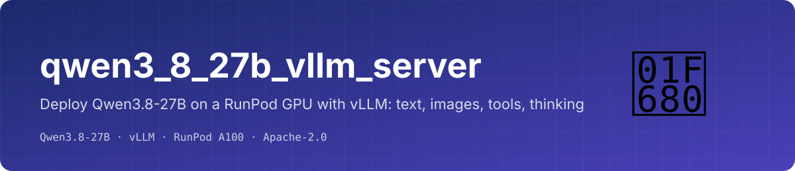
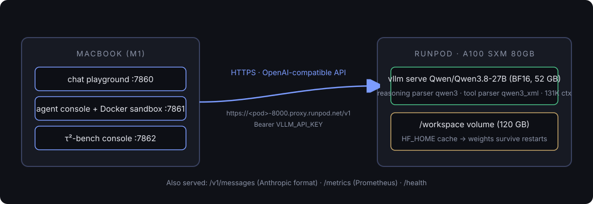
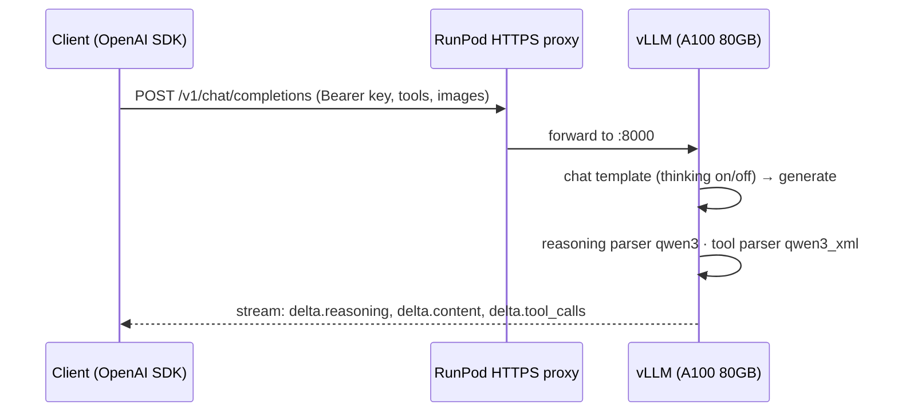

<p align="center"></p>

<p align="center">
  
  
  
  
  
</p>

Deploy **Qwen3.8-27B**, a dense 27B open-weights model with native **image + video** input, **262K context**, **thinking modes** and
**structured tool calls**, on a single rented GPU with vLLM, and get an OpenAI-compatible endpoint you own.

This is the deployment half of a three-repo project that evaluates the model as a chat assistant, a tool-using agent and a
coding agent:

| Repo | Runs where | Purpose |
|---|---|---|
| **qwen3_8_27b_vllm_server** (this) | RunPod GPU pod | serve the model |
| [qwen3_8_27b_workloads](https://github.com/Harpreet221295/qwen3_8_27b_workloads) | your laptop | capability suites, chat playground, playable τ²-bench console |
| [qwen3_8_27b_agent_harness](https://github.com/Harpreet221295/qwen3_8_27b_agent_harness) | your laptop | agentic coding + terminal eval in Docker sandboxes |

## Architecture

<p align="center"></p>



## Quick start (RunPod web UI, ~10 minutes)

1. **Pods → Deploy → A100 SXM 80GB** (Community Cloud, On-Demand, $1.59/hr as of Sep 2026). Template **vLLM Latest** (`vllm/vllm-openai:latest`).
2. **Edit** the template:
   - Container start command (this image appends it to `vllm serve`):
     ```
     Qwen/Qwen3.8-27B --served-model-name qwen3.8-27b --host 0.0.0.0 --port 8000 --max-model-len 131072 --gpu-memory-utilization 0.92 --max-num-seqs 64 --reasoning-parser qwen3 --enable-auto-tool-choice --tool-call-parser qwen3_xml --trust-remote-code
     ```
   - Container disk **120 GB**, volume disk **120 GB** at `/workspace`, expose HTTP port **8000**.
   - Env: `VLLM_API_KEY=<openssl rand -hex 24>`, `HF_HOME=/workspace/.huggingface`.
3. **Deploy.** First boot downloads 52 GB of weights (~5 min) and warms up (~3 min). Later boots take ~90 s from the volume.

Your endpoint: `https://<POD_ID>-8000.proxy.runpod.net/v1`

```bash
export QWEN_BASE_URL=https://<POD_ID>-8000.proxy.runpod.net/v1 QWEN_API_KEY=<your key>
./scripts/healthcheck.sh          # /health → 200, /models, one completion
python scripts/smoke_test.py      # text · thinking · image · tool call
```

Prefer scripts? `serve.sh` + `configs/*.env` presets and `runpod/create_pod.py` / `manage_pod.py` do the same from a terminal.

## Which GPU

| Variant | Weights | Fits | Preset |
|---|---|---|---|
| `Qwen/Qwen3.8-27B` (BF16, reference) | ~52 GB | 1× A100/H100 80GB · 2× 48GB (TP=2) | `configs/h100_80gb_bf16.env`, `2x_a6000_48gb_fp8.env` |
| `Qwen/Qwen3.8-27B-FP8` | ~26 GB | 1× L40S / RTX 6000 Ada 48GB | `configs/l40s_48gb_fp8.env` |
| `unsloth/Qwen3.8-27B-NVFP4` | ~12 GB | RTX 5090 / B200 (Blackwell) | `configs/rtx5090_nvfp4.env` |

Decode is memory-bound: expect ~30 tok/s single-stream on an A100 (2.0 TB/s), ~50 on an H100 (3.35 TB/s); much higher aggregate under concurrency.

## Using the endpoint

<details><summary><b>Thinking on / off, sampling, structured output, images</b></summary>

```python
from openai import OpenAI
c = OpenAI(base_url=QWEN_BASE_URL, api_key=QWEN_API_KEY)

# thinking OFF (fast): temp 0.7, top_p 0.8, top_k 20, presence_penalty 1.5
r = c.chat.completions.create(model="qwen3.8-27b", messages=[{"role":"user","content":"hi"}],
      temperature=0.7, top_p=0.8, extra_body={"top_k": 20, "presence_penalty": 1.5,
      "chat_template_kwargs": {"enable_thinking": False}})

# thinking ON: reasoning_effort low | medium | xhigh (default) → r.choices[0].message.reasoning
r = c.chat.completions.create(model="qwen3.8-27b", messages=[...], temperature=1.0, top_p=0.95,
      extra_body={"top_k": 20, "chat_template_kwargs": {"reasoning_effort": "low"}})

# structured output
extra_body={"structured_outputs": {"choice": ["positive", "negative"]}}   # or {"regex": ...}; response_format json_schema also works

# images: OpenAI image_url parts, base64 data URLs are fine
```
The server also speaks Anthropic's `/v1/messages` and exposes `/metrics` (Prometheus) and `/health`.
</details>

## Gotchas we hit (so you don't)
- `--limit-mm-per-prompt` needs JSON in current vLLM (`{"image":4}`); the old `image=4` form crash-loops the pod.
- The template's default key `sk-$RUNPOD_POD_ID` is guessable from the public URL: set a random `VLLM_API_KEY`.
- Reasoning comes back as `message.reasoning` (not `reasoning_content`); `guided_choice`/`guided_regex` were replaced by `structured_outputs`.
- Only `low | medium | xhigh` reasoning efforts exist.

Full story, click by click, with costs and SSH access: **[docs/runpod_qwen_setup.md](docs/runpod_qwen_setup.md)**.

## License
Apache-2.0. Model weights are Qwen's under their own license.
